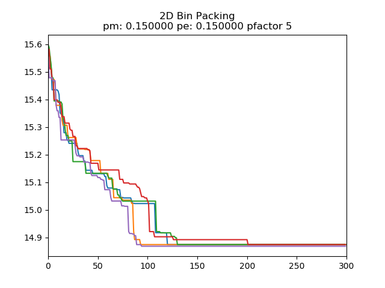
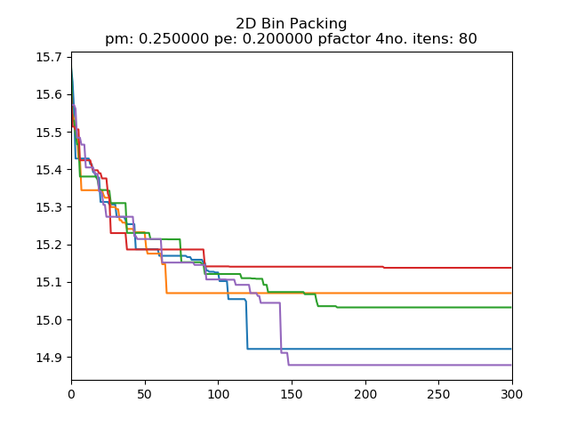
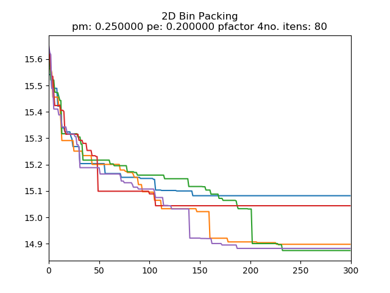

# Meta AG (Automático)
 

# BRKGA tradicional (Manual)
## (0,10 ; 0,15)
Taxa elite: 0,10 |Taxa mutantes: 0,15
:-------------------------:|:-------------------------:
  |  
  |  
  |  

## (0,10 ; 0,20)
Taxa elite: 0,10 |Taxa mutantes: 0,20
:-------------------------:|:-------------------------:
  |  
  |  
  |  

## (0,10 ; 0,25)
Taxa elite: 0,10 |Taxa mutantes: 0,25
:-------------------------:|:-------------------------:
  |  
  |  
  |  

## (0,15 ; 0,15)
Taxa elite: 0,15 |Taxa mutantes: 0,15
:-------------------------:|:-------------------------:
  |  
  |  
  |  

## (0,15 ; 0,20)
Taxa elite: 0,15 |Taxa mutantes: 0,20
:-------------------------:|:-------------------------:
  |  
  |  
  |  

## (0,15 ; 0,25)
Taxa elite: 0,15 |Taxa mutantes: 0,25
:-------------------------:|:-------------------------:
  |  
  |  
  |  

## (0,20 ; 0,15)
Taxa elite: 0,20 |Taxa mutantes: 0,15
:-------------------------:|:-------------------------:
  |  
  |  
  |  

## (0,20 ; 0,20)
Taxa elite: 0,20 |Taxa mutantes: 0,20
:-------------------------:|:-------------------------:
  |  
  |  
  |  

## (0,20 ; 0,25)
Taxa elite: 0,20 |Taxa mutantes: 0,25
:-------------------------:|:-------------------------:
  |  
  |  
  |  